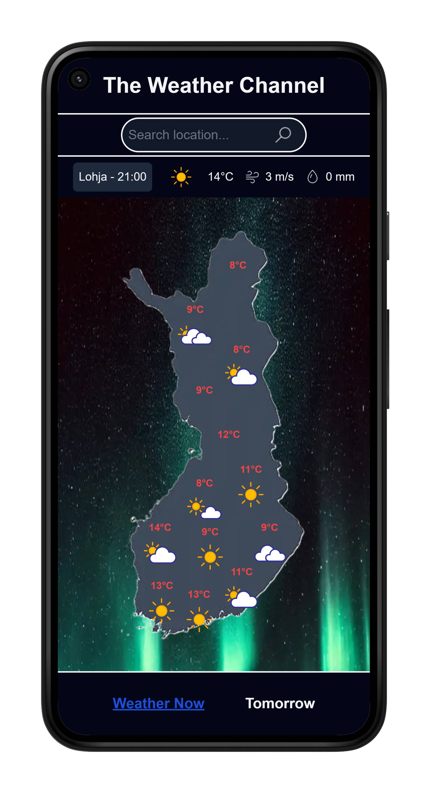
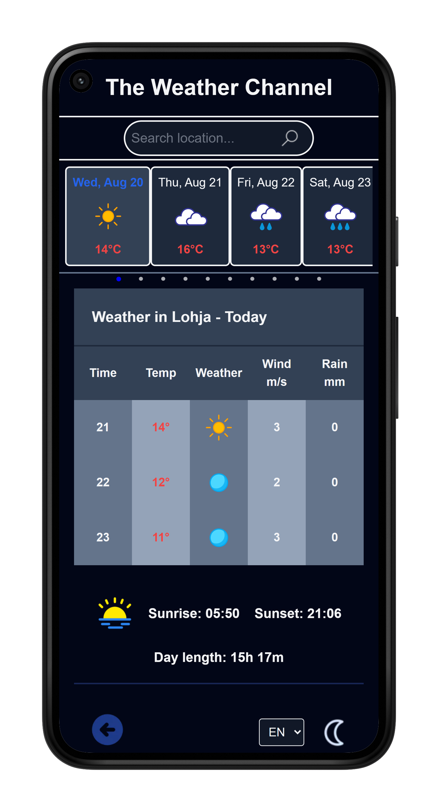

Weather App

## 🚀 Live app

👉 [Try it here](https://weatherapp-chi-neon.vercel.app/)

## Features

- View overall weather in Finland
- Search weather by city
- Add favorite cities
- 10-day forecast
- Daily weather report
- Responsive design with smooth UX
- Installable as a PWA on your phone
- Change language and theme 

**Tech Stack**

- **Framework:** Next.js
- **Hosting:** Vercel
- **Database** Supabase
- **State Management:** Zustand
- **Styling:** Tailwind CSS

## 📸 Screenshots





## ⚙️ Getting Started

```bash
git clone https://github.com/MatiasTervonen/weatherapp.git
cd weather-app
pnpm install
pnpm dev
```
